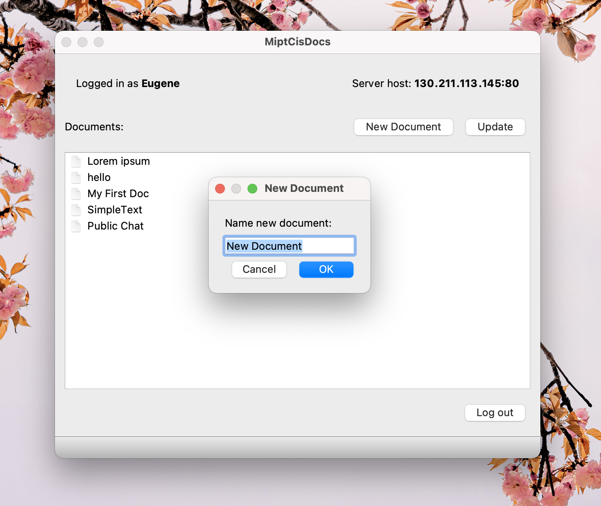

# CIS Docs  

CIS Docs allows users to create and edit documents online while collaborating with other users in real-time. 
Project is based on symmetrical algorithm employing an unending cycle of background difference (diff) and patch operations called [Differential synchronization](https://neil.fraser.name/writing/sync/eng047-fraser.pdf).

Application is a desktop client that can be run on Windows, Linux and Mac; and a server which is run on Google Cloud.

# Setup and First Run

Latest standalone application is available for download at [repository releases](https://github.com/ivigns/mipt-cis-docs/releases).

At first run you will be proposed to enter host and port of our server. Currently available server:
 - Host: **34.123.108.34**
 - Port: **80**

If app does not start (which is an unusual case), you need to build it by yourself for your version of OS. See **Build Application** section below.

# UI overview

After launching the application, you will see a login screen where you need to enter your username.


Press "Log in" button you and your are in game! You will find yourself on the home screen where you can see all the documents.


To update list of documents press the "update" button. After pressing "New Document" the new document will be created.



Select your document from the menu and double-click on it. 


At this point, you can write everything that come to your mind. Go ahead try it!


This document will be accessible for all the users of our application, so do not be scared if you will see some edits that have not been made by you :blush:

To save your changes go to the "File" menu and press Save/Save as.

Enjoy!

# Build Application

If there is no executable suitable for your version of OS, you will have to build it from source code. To do so, you should clone this repository and run two scripts.

## Ubuntu

Run from the root of the repository:
```bash
bash client/install_ubuntu_requirements.sh
bash client/build_ubuntu.sh
```
Executable would be located at `dist` folder.

## Mac OS

Similarly, run:
```bash
bash client/install_mac_os_requirements.sh
bash client/build_mac_os.sh
```

## Windows

First, try to execute bash scripts from GIT Bash:
```bash
bash client/install_windows_requirements.sh
bash client/build_windows.sh
```
If there is any error, you should install requirements described in [client/windows_requirements.md](https://github.com/ivigns/mipt-cis-docs/blob/master/client/windows_requirements.md) and rerun scripts.

# Contribution

Feel free to suggest features, report bugs, write them in the issues. We thoroughly watching after them.
